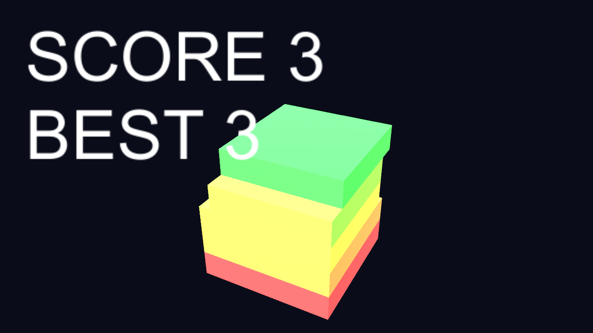

# 🔮 Orb Merge

> オーブを落として融合させる、ネオン調のスイカ風物理パズル

同じオーブ同士を融合させてより大きなオーブへと成長させていく、物理ベースのマージゲームです。コンボを繋ぎつつ、フィールドからのあふれ（オーバーフロー）を避けながらスコアを伸ばします。Unity で開発し、WebGL ビルドをブラウザ上でプレイできます。


🔗 **[Live Demo](https://masafykun.github.io/orb-merge/)**

---

## 📸 スクリーンショット


---

## 🎮 操作方法
| 操作 | 動作 |
|---|---|
| クリック / タップ | オーブを落とす |
| 同じオーブを接触させる | 融合してより大きなオーブになる |

---

## ✨ 特徴
- **物理ベースのマージ** — オーブが衝突・落下し、同種が融合して成長する
- **コンボ** — 連鎖的な融合でスコアを伸ばす
- **オーバーフロー回避** — フィールドからあふれる前に整理する緊張感
- **ネオン調のビジュアル** — スイカ風ルールをネオンテイストで表現
- **ブラウザプレイ対応** — GitHub Pages 上の WebGL ビルドで直接遊べる

---

## 🛠️ 技術スタック
| カテゴリ | 技術 |
|---|---|
| ゲームエンジン | Unity (6000.0.77f1) |
| 言語 | C#（ソースは `src/` 配下） |
| ビルド | WebGL |
| 配信 | GitHub Pages |

---

## 🚀 セットアップ
```bash
# ブラウザでそのままプレイする場合は Live Demo を開く
# ローカルで開発する場合は Unity (6000.0.77f1) でプロジェクトを開く
# C# ソースは src/ 配下にあります
```

---

## ライセンス
[](https://opensource.org/licenses/MIT)

このプロジェクトは **MIT ライセンス** のもとで公開しています。

© 2026 masafykun (https://github.com/masafykun)
